# 项目概览

## 流程概要



## 详细步骤说明

以下的“修改”，均指原地修改。

项目传入参数为一个文件夹，文件夹下为被处理项目的源代码。

### [1. HTML 文件预处理](./HTMLProcessor.md)

- 说明：对文件夹下所有的 HTML 都进行预处理
- 输入：HTML 文件
- 输出：
  - 修改后的 HTML 文件
  - 导出的 JavaScript 文件
- 备注：
  - 将 HTML 中所有内嵌的 JavaScript 代码提取出来，存储为外部 JavaScript 文件并将内嵌 `<script>` 替换为外部 JavaScript 文件引用

### 2. 识别 JavaScript 文件

- 说明：识别出文件夹下所有的 JavaScript 文件
- 输入：文件夹
- 输出：
  - JavaScript 文件数组 `ScriptFile[]`
- 备注：
  - 目前不考虑 ECMAScript Module
  - （暂定）文件数据结构

```ts
class ScriptFile
{
    filePath: string;         // 文件的绝对路径，包含文件名
}
```

### 3. JavaScript 文件预处理

- 说明：对 JavaScript 文件中存在的 `new Function` 和 `eval` 进行替换处理
- 输入：`ScriptFile[]`
- 输出：对文件原地修改
- 备注：无

### [4. 所有函数识别](./FunctionScanner.md)

- 说明：识别出文件夹下所有 JavaScript 文件中定义的函数
- 输入：`ScriptFile[]`
- 输出：`FunctionInfo[]`
- 备注：
  - **存在一个 `FunctionInfo` 实例 `global`，单独处理**
  - （暂定）数据结构

```ts
class FunctionInfo
{
    scriptFile: Readonly<ScriptFile> | null;  // 方法所在文件，当描述 global 时值为 null
    startIndex: number | null;                // 函数代码开始的字符位置，当描述 global 时值为 null
    endIndex: number | null;                  // 函数代码结束的字符位置（不含），当描述 global 时值为 null
    bodyStartIndex: number | null;            // 方法函数体开始的字符位置，当描述 global 时值为 null
    bodyEndIndex: number | null;              // 方法函数体结束的字符位置（不含），当描述 global 时值为 null
}
```

### [5. 静态函数调用识别](./StaticCallGraphBuilder.md)

- 输入：`ScriptFile[]`
- 输出：`FunctionCall[]`
- 备注：
  - （暂定）数据结构

```ts
class FunctionCall
{
    caller: FunctionInfo;
    callee: FunctionInfo[];
}
```

### [6. 动态函数调用识别](./DynamicCallGraphBuilder.md)

- 输入：`ScriptFile[]`
- 输出：`FunctionCall[]`
- 备注：无

### 7. 调用图合并

- 输入：多个 `FunctionCall[]`
- 输出：合并过的 `FunctionCall[]`
- 备注：无

### 8. [孤立结点识别](./IsolatedFunctionIdentifier.md)

- 输入：`FunctionCall[]`，其中包含所有调用关系；`FunctionInfo[]`，其中包含所有函数信息
- 输出：`FunctionInfo[]`，其中包含所有孤立结点
- 备注：
  - 孤立结点指从 `global` 不可达的结点

### 9. 函数体删除

- 输入：`FunctionInfo[]`，其中包含所有孤立结点
- 输出：删除 `FunctionInfo` 实例中对应文件中函数的函数体
- 备注：
  - 删除不改变函数的行号信息
  - 不能使用全空格替换。可以在空格中插入一个字面量
    - 主要为了兼容 `() => 1+1` 的箭头函数 